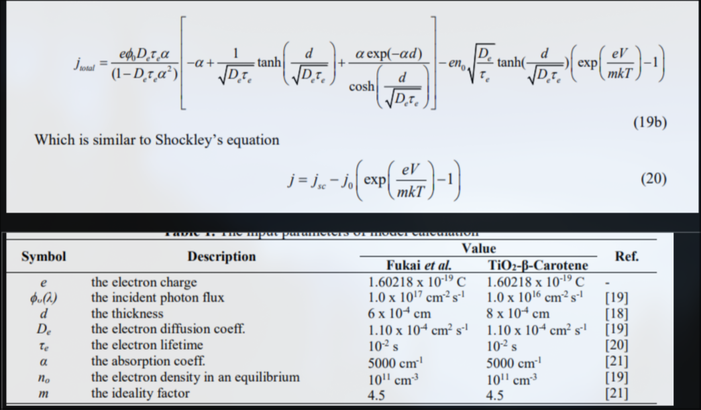

# DSSC fitting

## references lib
[https://docs.scipy.org/doc/scipy/tutorial/optimize.html#tutorial-optimize-global]\
[https://docs.scipy.org/doc/scipy/reference/generated/scipy.optimize.curve_fit.html#scipy.optimize.curve_fit]\
[https://lmfit.github.io/lmfit-py/]\
[https://pypi.org/project/odrpack/]
